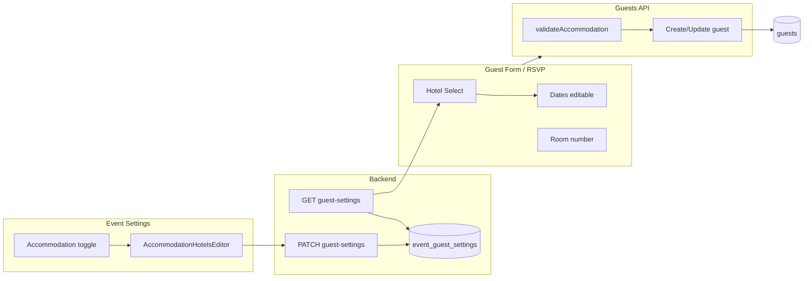

# Accommodation Feature

**Feature:** Event-level accommodation tracking with predefined hotels, per-guest selection, editable dates, and room number.  
**Status:** Implemented  
**Document Date:** 2026-02-06

---

## Overview

When an organizer enables **Accommodation** for an event, they set **one check-in and one check-out date for the whole event** (same for all hotels) and define the list of hotel names in Event Settings. When adding or editing a guest, the user selects one hotel from a dropdown; check-in and check-out dates default to the event’s dates but can be changed per guest. A **room number** can be assigned (e.g. after the guest confirms) and is not tied to event-day check-in. Guests can also indicate accommodation needs and select a hotel (and optionally edit dates) on the public RSVP form when the feature is enabled.

---

## Plan and design decisions

### Hotel list is event-defined

- Organizers **define all hotels** when they enable Accommodation (in Event Settings → Guest Fields → Accommodation).
- For each hotel they enter: **name**, **check-in date**, **check-out date** (defaults for that hotel).
- When adding/editing a guest, **hotel is selected only** (dropdown); no free-text hotel name.
- **Guests cannot enter hotel names themselves**—they only choose from the event’s list.

### Check-in / check-out dates

- **Event level:** **One check-in date and one check-out date for the entire event** (same for all hotels). Set in Event Settings when Accommodation is enabled.
- **Per guest:** Check-in and check-out are **editable** on the add/edit guest page. They default to the event’s dates (and when the user selects a hotel they are pre-filled from the event dates) but can be changed per guest.
- **Validation:** Check-out date must be on or after check-in date (when setting event accommodation dates and when saving a guest).

### Room number

- **When it’s set:** After the guest **confirms** (RSVP). Room number is for assigning a room from the block, not for event-day check-in.
- **Where it’s editable:** Dashboard guest form (add/edit) when accommodation is enabled; optionally visible in the guest list. **Not** set or changed when the guest clicks “Check In” at the event.
- **Who fills it in:** Organizer (or staff) in the dashboard. Can be extended later to allow the guest to provide it on the RSVP form.

### Multiple hotels per event

- One event may have multiple hotels (e.g. hotel blocks at Hotel A, Hotel B, Hotel C). The event’s **accommodation hotels** list holds all of them; each guest selects one.

### RSVP

- When accommodation is enabled and the event has at least one hotel, the public RSVP form shows: “I need hotel accommodation” (switch), hotel dropdown, and editable check-in/check-out dates. Submissions are validated (hotel from list, check-out ≥ check-in) and persisted.

---

## User experience

### Event Settings (Guest Fields tab)

- **Accommodation** toggle: “Track if guests need hotel accommodation.” Optional **Required** checkbox for the needs-accommodation question.
- When enabled:
  - **Check-in date** and **Check-out date** (one pair for the whole event, same for all hotels).
  - **Hotels for this event**: add/edit/remove hotel names only (no per-hotel dates).
  - Validation: check-out ≥ check-in for the event dates.

### Add / Edit Guest (dashboard)

- When Accommodation is enabled and “Needs accommodation” is Yes:
  - **Hotel:** Dropdown of the event’s hotels (no free text). Selecting a hotel pre-fills check-in and check-out from the event’s dates.
  - **Check-in date** and **Check-out date:** Editable; default from event (same for all hotels).
  - **Room number:** Optional text (e.g. “204”).
- If no hotels are defined yet, a message prompts the organizer to add them in Event Settings.

### Guest list

- When Accommodation is enabled, an **Accommodation** column shows Yes/No and, when Yes, hotel name and room number (e.g. “Yes · Hotel A (204)”).

### RSVP form

- When the event has accommodation enabled and at least one hotel:
  - For “Yes, I’ll be there” or “Maybe”: **I need hotel accommodation** switch; then hotel dropdown and editable check-in/check-out dates.
  - Submitting sends needs, hotel, and dates; backend validates and saves.

### Export and audit

- **CSV export:** Includes `needsAccommodation`, `hotelName`, `checkInDate`, `checkOutDate`, `roomNumber`.
- **Guest audit:** Accommodation fields (including `roomNumber`) appear in the audit when accommodation is enabled for the event.

---

## Architecture

### Data model

**Event guest settings**

- `accommodation_check_in_date` (text): Event-level check-in date (YYYY-MM-DD). Same for all hotels.
- `accommodation_check_out_date` (text): Event-level check-out date (YYYY-MM-DD). Same for all hotels.
- `accommodation_hotels` (text, JSON): Array of `{ id, name }`. Hotel names only; dates come from event-level fields above.

**Guests**

- `needs_accommodation` (boolean): Whether the guest needs accommodation.
- `hotel_name` (text): Selected hotel name (must match one of the event’s `accommodationHotels` when the list is non-empty).
- `check_in_date` / `check_out_date` (timestamp): Per-guest dates; default from hotel, editable.
- `room_number` (text): Assigned on confirm; not set at event check-in.

### Backend

**Schema and migration**

- `backend/src/db/schema/events.ts`: `guests.roomNumber`; `eventGuestSettings.accommodationCheckInDate`, `accommodationCheckOutDate`, `accommodationHotels` (hotels as `{ id, name }` only).
- Migrations: `0006_accommodation_hotels_and_room.sql` (room + accommodationHotels); `0007_accommodation_event_dates.sql` (event-level check-in/check-out dates).

**Events API** (`backend/src/routes/events.ts`)

- `accommodationHotelSchema`: Validates `id` and `name` only (no per-hotel dates).
- `accommodationCheckInDate` / `accommodationCheckOutDate`: Optional YYYY-MM-DD; schema refine: check-out ≥ check-in when both set.
- GET/PATCH `/events/:uuid/guest-settings`: Read/write `accommodationCheckInDate`, `accommodationCheckOutDate`, and `accommodationHotels`.

**Guests API** (`backend/src/routes/guests.ts`)

- Create/update guest: Accept `roomNumber`; when accommodation data is present, load event guest settings and run `validateAccommodation()` (hotel in list when list non-empty; check-out ≥ check-in). Persist accommodation fields and `roomNumber`.
- List guests: Select includes `roomNumber`.
- CSV import: Parser and duplicate-insert support `checkInDate`, `checkOutDate`, `roomNumber`.

**RSVP API** (`backend/src/routes/rsvp.ts`)

- GET `/rsvp/:token`: Returns guest accommodation fields and `guestSettings: { enableAccommodation, accommodationHotels }`.
- POST `/rsvp/:token`: Body may include `needsAccommodation`, `hotelName`, `checkInDate`, `checkOutDate`; same accommodation validation; updates guest and audit.

**CSV** (`backend/src/lib/csv.ts`)

- ParsedGuest/GuestRow: `checkInDate`, `checkOutDate`, `roomNumber`. Import parses dates; export includes these columns.

### Frontend

**Types** (`frontend/src/hooks/use-guests.ts`)

- `AccommodationHotel`: `{ id, name }` (no dates; dates are event-level).
- `GuestSettingsResponse` / `UpdateGuestSettingsInput`: `accommodationCheckInDate`, `accommodationCheckOutDate`, `accommodationHotels`.
- `GuestResponse` / `CreateGuestInput` / `UpdateGuestInput`: optional accommodation fields and `roomNumber`.
- `RsvpPageData`: guest accommodation fields and `guestSettings`; `RsvpSubmitInput`: accommodation fields.

**Event settings** (`frontend/src/components/guests/GuestFieldSettings.tsx`)

- When Accommodation is on: event-level **Check-in date** and **Check-out date** (one pair); `AccommodationHotelsEditor` – add/edit/remove hotel names only; saved as `accommodationCheckInDate`, `accommodationCheckOutDate`, `accommodationHotels`.

**Guest form** (`frontend/src/components/guests/GuestForm.tsx`)

- When Accommodation is on and “Needs accommodation” is Yes: hotel **Select** from `guestSettings.accommodationHotels` (uses value `__none__` for “no hotel” to satisfy Radix Select); check-in/check-out **Input type="date"** (editable), pre-filled from event dates when selecting a hotel; room number **Input**. Zod `superRefine`: check-out ≥ check-in. Submit uses `guestSettingsRef.current` and includes accommodation fields with normalized types so they persist on create and edit.

**Guest table** (`frontend/src/components/guests/GuestTable.tsx`)

- When `guestSettings.enableAccommodation`: **Accommodation** column with Yes/No and hotel/room when applicable.

**RSVP view** (`frontend/src/components/guests/RsvpView.tsx`)

- When `guestSettings?.enableAccommodation` and `accommodationHotels.length > 0`: accommodation section with switch, hotel Select, and date inputs (defaults from `guestSettings.accommodationCheckInDate` / `accommodationCheckOutDate`); state synced from guest on load; submit includes accommodation fields.

**Audit** (`frontend/src/components/guests/GuestAuditDialog.tsx`)

- `roomNumber` in field labels and shown when accommodation is enabled.

### Data flow (high level)



---

## Files touched

| Area        | Files |
|------------|--------|
| Backend    | `backend/src/db/schema/events.ts`, `backend/drizzle/0006_accommodation_hotels_and_room.sql`, `backend/drizzle/0007_accommodation_event_dates.sql`, `backend/drizzle/meta/_journal.json`, `backend/src/routes/events.ts`, `backend/src/routes/guests.ts`, `backend/src/routes/rsvp.ts`, `backend/src/lib/csv.ts` |
| Frontend   | `frontend/src/hooks/use-guests.ts`, `frontend/src/components/guests/GuestFieldSettings.tsx`, `frontend/src/components/guests/GuestForm.tsx`, `frontend/src/components/guests/GuestFormPageView.tsx`, `frontend/src/components/guests/GuestTable.tsx`, `frontend/src/components/guests/RsvpView.tsx`, `frontend/src/components/guests/GuestAuditDialog.tsx` |

---

## Migration

Apply the migrations so the new columns exist:

```bash
cd backend
npm run db:migrate:local   # local D1
# or
npm run db:migrate         # remote D1
```

- **0006:** `guests.room_number`, `event_guest_settings.accommodation_hotels`.
- **0007:** `event_guest_settings.accommodation_check_in_date`, `accommodation_check_out_date`.

Existing rows: new columns are nullable; no backfill required. Existing `accommodation_hotels` JSON may have the old per-hotel `checkInDate`/`checkOutDate`; the app now uses event-level dates and treats hotels as `{ id, name }` only.

---

## Implementation notes (guest form & save)

These details help avoid regressions when changing the guest form or API.

### Loading guest settings before showing the form

- **Guest form page** (`GuestFormPageView.tsx`): The page waits for **guest settings** to load (in addition to event and, in edit mode, guest) before rendering the form. That way the accommodation section (and other optional sections) are present on first paint when accommodation is enabled.
- If the form rendered before guest settings were loaded, `guestSettings` would be `null` and the accommodation block would not show until a later re-render.

### Hotel Select (Radix UI)

- Radix `<Select.Item />` must not use an **empty string** as `value` (reserved for clearing the selection).
- The “Select hotel” / no-hotel option uses a **sentinel value** `__none__` instead of `""`. The Select’s controlled value maps empty to `__none__`; `onValueChange` maps `__none__` back to `""` before updating form state and payload.

### Ensuring accommodation is saved (create & edit)

- **Form defaultValues:** The guest form’s `defaultValues` include all optional fields (e.g. `needsAccommodation: false`, `hotelName: ''`, `checkInDate: ''`, `checkOutDate: ''`, `roomNumber: ''`) so they are always part of the form state and included in the submit payload.
- **Stale closure:** In `handleSubmit`, optional fields (including accommodation) are added to the payload using **`guestSettingsRef.current`** rather than `guestSettings` from the closure, so the latest settings are used at submit time.
- **Payload shape:** When accommodation is enabled we send: `needsAccommodation` as a boolean (`true`/`false`); `hotelName` with `""` and `__none__` normalized to `null`; `checkInDate`/`checkOutDate`/`roomNumber` as trimmed strings or `null`.

### Custom fields and PATCH 400

- The backend validates **custom field data** when `customFieldData` is present on create/PATCH. If validation fails (e.g. required field missing or wrong type), it returns **400 “Custom field validation failed”** and the **entire** request (including accommodation) is rejected.
- To avoid that and still save accommodation when custom data is invalid:
  - **Normalize** custom field values before send: only keys that exist in the current definitions, with types coerced (number, boolean, select, multiselect, date) to match backend validation.
  - **Send `customFieldData` only when valid:** If any required custom field is missing after normalization, do **not** include `customFieldData` in the payload. The backend then skips custom-field validation and does not overwrite existing custom data; the rest of the update (e.g. accommodation) succeeds.
- Helper: `normalizeCustomFieldData(values, definitions)` in `GuestForm.tsx` performs the normalization and returns `null` when a required field is empty.
