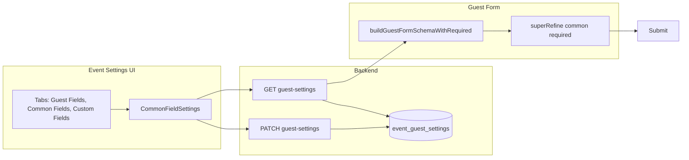

# Add Common Fields Tab to Event Settings

**Feature:** Common Fields tab in Event Settings  
**Status:** Implemented  
**Document Date:** 2026-02-06

---

## Overview

Event Settings includes a **Common Fields** tab that lets organizers choose which base guest fields (First Name, Last Name, Email, Phone) are **required** when adding or editing guests. First name is required by default; organizers can optionally require last name, email, or phone. These settings apply to the dashboard guest form and to the public RSVP form.

---

## User experience

- **Where:** Event → **Settings** → **Common Fields** tab (between Guest Fields and Custom Fields).
- **What:** A card listing four base fields with a **Required** switch for each:
  - **First Name** – Required by default.
  - **Last Name** – Optional by default.
  - **Email** – Optional by default.
  - **Phone** – Optional by default.
- **Actions:** Toggling a switch marks the field as required or optional. **Save changes** persists updates; **Reset** discards unsaved toggles.
- **Scope:** Settings are per event. Guest forms (dashboard add/edit and RSVP) validate and show required indicators (*) according to these settings.

---

## Architecture

### Data flow

### Backend

- **Schema:** Table `event_guest_settings` has four boolean columns:
  - `required_first_name` (integer, mode: boolean, default 0)
  - `required_last_name` (integer, mode: boolean, default 0)
  - `required_email` (integer, mode: boolean, default 0)
  - `required_phone` (integer, mode: boolean, default 0)
- **Migration:** `drizzle/0005_common_fields_required.sql` adds these columns. Existing rows get `0` (false) for all four. New settings rows created by the API set `requiredFirstName: true` and the others `false` so behavior matches the previous default (first name required).
- **API:**
  - **GET** `/events/:uuid/guest-settings` – Response includes `requiredFirstName`, `requiredLastName`, `requiredEmail`, `requiredPhone`.
  - **PATCH** `/events/:uuid/guest-settings` – Request body may include the four optional booleans; they are written to the same columns.

### Frontend

- **EventSettingsView** – Adds a **Common Fields** tab and `TabsContent` that renders an info card and `CommonFieldSettings`.
- **CommonFieldSettings** – Uses `useGuestSettings(eventUuid)` and `useUpdateGuestSettings(eventUuid)`. Renders four rows with a Required switch each; on save sends the four flags via the update mutation.
- **GuestForm** – Base schema allows empty first name; `buildGuestFormSchemaWithRequired` applies required validation for all four common fields from `guestSettings` (with backward-compatible defaults: `requiredFirstName` true, others false). Labels for First Name, Last Name, Email, and Phone show “*” when the field is required per settings.
- **Types** – `GuestSettingsResponse` and `UpdateGuestSettingsInput` in `use-guests.ts` include `requiredFirstName`, `requiredLastName`, `requiredEmail`, `requiredPhone`.

### Backward compatibility

- **Existing events:** Rows created before the migration have no columns; after migration they get `0` for all four. The frontend treats missing `requiredFirstName` as `true` and missing others as `false`, so behavior stays “first name required, others optional.”
- **New events:** When the API creates a new `event_guest_settings` row, it sets `requiredFirstName: true` and the other three `false`.

---

## Key files

| Area        | File | Purpose |
|------------|------|--------|
| UI tab     | `frontend/src/components/events/EventSettingsView.tsx` | Common Fields tab and TabsContent |
| Component  | `frontend/src/components/guests/CommonFieldSettings.tsx` | Four Required toggles and save/reset |
| Schema     | `backend/src/db/schema/events.ts` | `eventGuestSettings` common-field columns |
| Migration | `backend/drizzle/0005_common_fields_required.sql` | Add four required_* columns |
| API        | `backend/src/routes/events.ts` | Zod schema, GET/PATCH mapping, default insert |
| Types      | `frontend/src/hooks/use-guests.ts` | `GuestSettingsResponse`, `UpdateGuestSettingsInput` |
| Validation | `frontend/src/components/guests/GuestForm.tsx` | superRefine + dynamic required labels |

---

## Related

- **Guest Fields** tab – Configures optional feature fields (address, meal choice, accommodation, etc.) and their required flags.
- **Custom Fields** tab – User-defined fields and their required flag.
- **Guest form** – Dashboard and RSVP forms both respect common-field required settings when `eventUuid` / guest settings are available.
