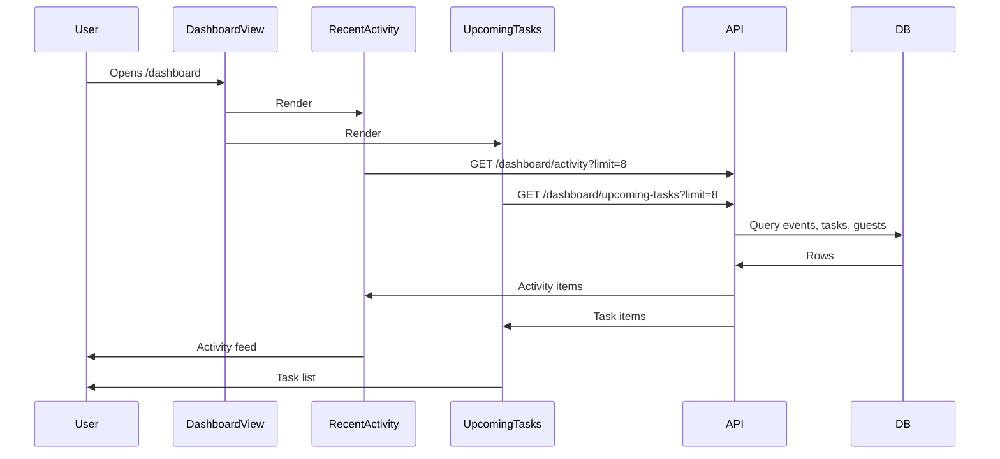

# Recent Activity Feed and Upcoming Tasks

**Feature:** Dashboard Activity Feed & Upcoming Tasks  
**Status:** Implemented  
**Document Date:** 2026-02-18

---

## Overview

The dashboard home page displays two new cross-event widgets:

1. **Recent Activity** -- a unified feed of recent actions across all the user's events (event creation/updates, tasks added/completed, guests added, template applications).
2. **Upcoming Tasks** -- a list of incomplete tasks with due dates across all events, sorted by urgency, with overdue highlighting.

Both widgets aggregate data from all events the user has access to: personal events, events belonging to organizations they are a member of, and events where they are an accepted collaborator.

---

## User experience

- **Where:** Dashboard home page (`/dashboard`), rendered in a two-column grid between Quick Actions and Recent Events.
- **Recent Activity card:**
  - Each item shows a color-coded icon (by activity type), a description, a relative timestamp ("2h ago"), and the parent event name.
  - Clicking an item navigates to the relevant page (event detail, tasks list, or guest list).
  - Activity types: event created, event updated, task added, task completed, guest added, template applied.
  - Tasks created from a template are grouped into a single "Applied 'X' template" entry instead of showing individual tasks.
- **Upcoming Tasks card:**
  - Each item shows the task title, a human-readable due date, the parent event name, and a color-coded priority badge.
  - Overdue tasks are highlighted with red text (e.g. "2 days overdue").
  - Clicking an item navigates to the event's task list (`/dashboard/events/:uuid/tasks`).
- Both cards show skeleton loading states, error states, and empty states.

### Dashboard layout

```
Stats (4-col grid)
Quick Actions
[Recent Activity]  [Upcoming Tasks]   <-- side-by-side on md+, stacked on mobile
Recent Events
```

---

## Architecture

### Data flow



### Event access pattern

Both endpoints determine accessible events using a shared SQL sub-query that selects event IDs where:

- The user is the event owner (`events.userId`), OR
- The event belongs to an organization the user is a member of (`organizationMember`), OR
- The user is an accepted collaborator on the event (`eventCollaborators.acceptedAt IS NOT NULL`).

Soft-deleted events (`deletedAt IS NOT NULL`) are excluded.

---

## API

### GET `/api/v1/dashboard/activity`

**Auth:** Required.

**Query parameters:**

| Param  | Type   | Default | Description            |
|--------|--------|---------|------------------------|
| `limit`| number | 10      | Max items (1--50)      |

**How it works:**

Three parallel queries fetch recent records from `events`, `tasks`, and `guests` (each limited to `limit * 2`). Results are mapped to activity items:

- **Events:** If `createdAt` and `updatedAt` are within 5 seconds, the event is considered newly created (`event_created`); otherwise it is treated as updated (`event_updated`).
- **Tasks:** Tasks with a `sourceTemplateId` are grouped by (templateId, eventUuid, createdAt) into a single `template_applied` entry (e.g., "Applied 'Wedding' template"). Non-template tasks produce individual `task_created` entries. Completed non-template tasks additionally produce a `task_completed` entry timestamped at `completedAt`.
- **Guests:** Each guest produces a `guest_added` entry with the guest's full name.

All items are combined, sorted by timestamp descending, and sliced to `limit`.

**Response:**

```json
{
  "success": true,
  "data": [
    {
      "type": "template_applied",
      "description": "Applied 'Wedding' template",
      "timestamp": "2026-02-18T15:00:00.000Z",
      "eventUuid": "abc-123",
      "eventTitle": "Wedding Reception"
    },
    {
      "type": "task_completed",
      "description": "Completed task 'Book venue'",
      "timestamp": "2026-02-18T14:30:00.000Z",
      "eventUuid": "abc-123",
      "eventTitle": "Wedding Reception",
      "entityUuid": "task-456"
    },
    {
      "type": "event_created",
      "description": "Created event 'Birthday Party'",
      "timestamp": "2026-02-18T10:00:00.000Z",
      "eventUuid": "def-789",
      "eventTitle": "Birthday Party"
    }
  ]
}
```

### GET `/api/v1/dashboard/upcoming-tasks`

**Auth:** Required.

**Query parameters:**

| Param  | Type   | Default | Description            |
|--------|--------|---------|------------------------|
| `limit`| number | 10      | Max items (1--50)      |

**How it works:**

Queries the `tasks` table joined with `events` for all accessible events, filtering to:

- Not soft-deleted
- Status is not `completed`
- `dueDate` is not null

Results are ordered by `dueDate ASC` (most urgent first). Each row is enriched with an `isOverdue` boolean computed by comparing `dueDate` to the current time.

**Response:**

```json
{
  "success": true,
  "data": [
    {
      "uuid": "task-456",
      "title": "Book venue",
      "dueDate": "2026-02-15T00:00:00.000Z",
      "priority": "high",
      "status": "pending",
      "eventUuid": "abc-123",
      "eventTitle": "Wedding Reception",
      "isOverdue": true
    },
    {
      "uuid": "task-789",
      "title": "Send invitations",
      "dueDate": "2026-03-01T00:00:00.000Z",
      "priority": "medium",
      "status": "in_progress",
      "eventUuid": "abc-123",
      "eventTitle": "Wedding Reception",
      "isOverdue": false
    }
  ]
}
```

---

## Frontend

### Hooks

**File:** `frontend/src/hooks/use-dashboard.ts`

| Hook                          | Query key                          | Endpoint                     | Stale time |
|-------------------------------|------------------------------------|------------------------------|------------|
| `useDashboardActivity(limit)` | `['dashboard', 'activity', limit]` | `GET /dashboard/activity`    | 1 min      |
| `useDashboardUpcomingTasks(limit)` | `['dashboard', 'upcoming-tasks', limit]` | `GET /dashboard/upcoming-tasks` | 1 min |

Both hooks follow the project's standard pattern: direct `fetch` with `credentials: 'include'`, a local `handleResponse<T>` helper, and TanStack Query for caching.

### Components

**RecentActivity** (`frontend/src/components/dashboard/RecentActivity.tsx`):

- Uses `useDashboardActivity(8)`.
- Maps each `ActivityType` to a color-coded icon via `activityConfig`:
  - `event_created` -- plus icon, primary color
  - `event_updated` -- pencil icon, blue
  - `task_created` -- clipboard icon, amber
  - `task_completed` -- check-circle icon, green
  - `guest_added` -- user-plus icon, purple
  - `template_applied` -- layout icon, indigo
- Timestamps displayed as relative time ("just now", "3h ago", "2d ago", or "Feb 18").
- Links: task and template activities navigate to `/dashboard/events/:uuid/tasks`, guest activities to `/dashboard/events/:uuid/guests`, event activities to `/dashboard/events/:uuid`.

**UpcomingTasks** (`frontend/src/components/dashboard/UpcomingTasks.tsx`):

- Uses `useDashboardUpcomingTasks(8)`.
- Due dates displayed as human-readable labels ("Due today", "Due tomorrow", "Due in 3 days", "2 days overdue", or "Mar 1").
- Priority shown as a color-coded badge: high (red), medium (amber), low (slate).
- Overdue due dates rendered with `text-destructive` and `font-medium`.
- Each item links to `/dashboard/events/:uuid/tasks`.

**DashboardView** (`frontend/src/components/dashboard/DashboardView.tsx`):

- Both components rendered in a `grid gap-6 md:grid-cols-2` layout.
- Both cards use `h-full` to maintain equal height in the grid.

---

## Files

| Area       | Path |
|------------|------|
| Schema     | `backend/src/db/schema/events.ts` (`tasks.sourceTemplateId` column) |
| Migration  | `backend/drizzle/0022_add_tasks_source_template_id.sql` |
| Route      | `backend/src/routes/dashboard.ts` |
| Route mount | `backend/src/routes/index.ts` (import + `api.route('/dashboard', dashboard)`) |
| Bulk endpoint | `backend/src/routes/tasks.ts` (sets `sourceTemplateId` on template tasks) |
| Templates  | `backend/src/lib/task-templates.ts` (template name lookup) |
| Hook       | `frontend/src/hooks/use-dashboard.ts` |
| Activity   | `frontend/src/components/dashboard/RecentActivity.tsx` |
| Tasks      | `frontend/src/components/dashboard/UpcomingTasks.tsx` |
| Dashboard  | `frontend/src/components/dashboard/DashboardView.tsx` |
| Barrel     | `frontend/src/components/dashboard/index.ts` |

---

## Schema changes

### `tasks` table

| Column | Type | Nullable | Description |
|--------|------|----------|-------------|
| `source_template_id` | text | Yes | Stores the template ID (e.g. `"wedding"`, `"birthday"`) when tasks are created via `POST /events/:uuid/tasks/bulk`. `NULL` for manually created tasks. |

**Migration:** `0022_add_tasks_source_template_id.sql`

```sql
ALTER TABLE `tasks` ADD `source_template_id` text;
```

### Template grouping logic

When the activity feed encounters tasks with `sourceTemplateId`:

1. Individual `task_created` / `task_completed` entries are **suppressed**.
2. Tasks are grouped by `(sourceTemplateId, eventUuid, createdAt)`.
3. Each group produces a single `template_applied` activity item with the template's display name looked up from `TASK_TEMPLATES`.

Tasks created before this change (without `sourceTemplateId`) continue to appear as individual entries.
