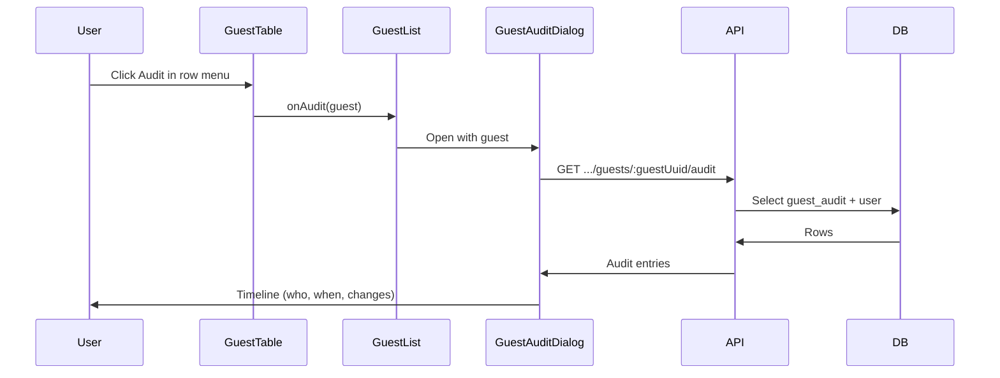

# Guest Audit History

**Feature:** Guest Audit History  
**Status:** Implemented  
**Document Date:** 2026-02-06

---

## Overview

Guest Audit History records who created or updated each guest and when, and (for updates) which fields changed. Event owners can open an **Audit** view from the guest row menu to see a timeline of actions—including RSVP responses—with optional fields (meal choice, accommodation, table assignment, etc.) shown only when those features are enabled for the event.

---

## User experience

- **Where:** Guest list → row actions (⋮) → **Audit**
- **What:** A dialog showing a chronological timeline of:
  - **Created** – When the guest was added and by whom (name/email)
  - **Updated** – Each edit with timestamp, actor, and a list of changed fields (e.g. “Meal choice: — → Vegetarian”, “Table: — → Table 5”)
  - **RSVP response** – When the guest submitted their RSVP (actor shown as “RSVP response”), with the same field-level changes (e.g. RSVP status, plus ones, dietary restrictions)

Optional fields (meal choice, accommodation, table assignment, address, plus one name, transportation, accessibility, custom fields) appear in the change list only when the corresponding option is enabled in **Event → Guest field settings**.

---

## Architecture

### Data flow



### Backend

- **Table:** `guest_audit` (see [Database](#database))
- **Write:** Audit rows are inserted when:
  - A guest is **created** (POST `/events/:eventUuid/guests`) – one row with `action: 'create'`, actor = current user, optional snapshot in `details`
  - A guest is **updated** (PATCH `/events/:eventUuid/guests/:guestUuid`) – one row with `action: 'update'`, actor = current user, `details.changes` = array of `{ field, from, to }`
  - A guest **submits RSVP** (POST `/rsvp/:token`) – one row with `action: 'update'`, `userId: null`, `details.source: 'rsvp'`, and `details.changes` for rsvpStatus, plusOnesCount, dietaryRestrictions
- **Read:** GET `/events/:eventUuid/guests/:guestUuid/audit` (auth required, same event access as other guest routes). Returns entries ordered by `createdAt` desc, with actor resolved from `user` (id, name, email).

### Frontend

- **Hook:** `useGuestAudit(eventUuid, guestUuid)` – fetches audit list; enabled when both IDs are set.
- **Components:**
  - **GuestTable** – New “Audit” dropdown item; calls `onAudit(guest)`.
  - **GuestList** – Holds `guestForAudit`, passes `onAudit` to `GuestTable`, renders **GuestAuditDialog** when a guest is selected for audit.
  - **GuestAuditDialog** – Uses `useGuestAudit`, displays timeline and filters change list by `guestSettings` so only enabled optional fields are shown.

---

## API

### GET `/events/:eventUuid/guests/:guestUuid/audit`

**Auth:** Required (same as other guest endpoints).

**Response:**

```json
{
  "success": true,
  "data": [
    {
      "id": 1,
      "action": "create",
      "createdAt": "2026-02-06T12:00:00.000Z",
      "actor": { "id": "user-id", "name": "Jane", "email": "jane@example.com" },
      "details": { "source": "dashboard", "snapshot": { "firstName": "John", "lastName": "Doe", "email": "john@example.com" } }
    },
    {
      "id": 2,
      "action": "update",
      "createdAt": "2026-02-06T14:30:00.000Z",
      "actor": null,
      "details": { "source": "rsvp", "changes": [
        { "field": "rsvpStatus", "from": "pending", "to": "confirmed" },
        { "field": "dietaryRestrictions", "from": null, "to": "Vegetarian" }
      ]}
    }
  ]
}
```

- `actor` is `null` for RSVP submissions.
- `details.changes` is only present for `action: 'update'`.
- `details.snapshot` is optional on create.

---

## Database

**Table: `guest_audit`**

| Column     | Type    | Description                                      |
|-----------|---------|--------------------------------------------------|
| `id`      | integer | Primary key, auto-increment                     |
| `guest_id`| integer | FK → `guests.id` (ON DELETE CASCADE)            |
| `user_id` | text    | FK → `user.id` (ON DELETE SET NULL); null = RSVP |
| `action`  | text    | `'create'` \| `'update'`                         |
| `details` | text    | JSON: `{ source?, snapshot?, changes? }`        |
| `created_at` | integer | Unix timestamp (Drizzle `mode: 'timestamp'`)  |

**Indexes:** `guest_id`, `created_at`.

**Migration:** `backend/drizzle/0003_guest_audit.sql`.

---

## Files

| Area    | Path |
|---------|------|
| Schema  | `backend/src/db/schema/guestAudit.ts` |
| Types   | `backend/src/db/types.ts` (GuestAudit, NewGuestAudit) |
| Relations | `backend/src/db/schema/relations.ts` (guestAuditRelations, guests.auditEntries, user.guestAuditEntries) |
| Routes  | `backend/src/routes/guests.ts` (audit insert on POST/PATCH, GET audit endpoint) |
| RSVP    | `backend/src/routes/rsvp.ts` (audit insert on RSVP submit) |
| Hook    | `frontend/src/hooks/use-guests.ts` (GuestAuditEntryResponse, guestKeys.audit, useGuestAudit) |
| Dialog  | `frontend/src/components/guests/GuestAuditDialog.tsx` |
| Table   | `frontend/src/components/guests/GuestTable.tsx` (onAudit, Audit menu item) |
| List    | `frontend/src/components/guests/GuestList.tsx` (guestForAudit, GuestAuditDialog) |

---

## Optional fields and labels

Change list uses a fixed mapping for field keys to display labels (e.g. `mealChoice` → “Meal choice”, `tableAssignment` → “Table assignment”). Optional fields are included in the list only when the corresponding event guest setting is enabled:

- Meal choice → `enableMealChoice`
- Table assignment → `enableTableAssignment`
- Accommodation (needs, hotel, check-in/out) → `enableAccommodation`
- Address → `enableAddress`
- Plus one name → `enablePlusOneName`
- Transportation → `enableTransportation`
- Accessibility → `enableAccessibility`
- Custom fields → presence of `customFieldDefinitions`

Core fields (name, email, phone, category, RSVP status, plus ones, dietary restrictions, notes) are always eligible to appear in the change list.

---

## Backfill and legacy data

Existing guests have no audit rows before this feature. The UI shows “No audit history yet” for them; history is only recorded from the first create/update after the feature is deployed. No backfill is implemented.

### Apply the migration (when npm is available):

```
cd backend && npm run db:generate (if you change schema again)
npm run db:migrate:local (local D1) or npm run db:migrate (remote)
```


###  https://local.drizzle.studio

```
npm run db:studio
```
