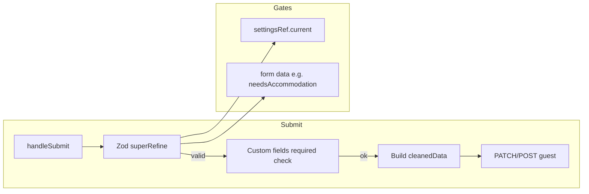

# Guest Form Validation

**Feature:** Consistent validation gating for the add/edit guest form so required and business-rule validations only run when the corresponding event settings and guest choices apply.  
**Status:** Implemented  
**Document Date:** 2026-02-10

---

## Overview

The guest form (add/edit guest in the dashboard) supports many optional sections: address, meal choice, accommodation, plus-ones, table assignment, accessibility, category, and custom fields. Each section is controlled by event-level settings (`enableAddress`, `enableAccommodation`, etc.). Validations must run only when:

- The feature is **enabled** for the event, and
- For per-guest toggles (e.g. "Needs accommodation"), the guest has that option **turned on**, and
- For "required" optional fields, the event has that field marked **required**.

This document describes how validation is gated and how form state and submit payload stay consistent when sections are hidden or toggled off.

---

## Where validation lives

| Location | Purpose |
|----------|---------|
| **Zod schema `superRefine`** in `buildGuestFormSchemaWithRequired()` | Required-field checks and business rules (e.g. check-out ≥ check-in, plus-ones count ≤ allowed). Runs on every submit; uses `settingsRef.current` so it sees current event settings. |
| **handleSubmit** in `GuestForm.tsx` | Required **custom fields** (not in the Zod schema). Uses `getMissingRequiredCustomFields()` and sets form errors + opens Custom Fields section when required custom fields are missing. |
| **Base Zod schema** (`guestFormSchema`) | Format validation (e.g. email format, max lengths). All optional/guest fields are `.optional().nullable()` so they are not required by the base schema; required-ness is enforced only in `superRefine`. |

---

## Validation gating (schema superRefine)

Every rule in `buildGuestFormSchemaWithRequired` is gated so it only runs when the corresponding feature is enabled and, where applicable, the guest is in the relevant state.

| Area | What is validated | Gate |
|------|------------------|------|
| **Core** | First name, last name, email, phone required | Event settings: `requiredFirstName`, `requiredLastName`, `requiredEmail`, `requiredPhone`. No enable toggle; core fields are always shown. |
| **Address** | Street address required | `s.enableAddress && requiredAddress` |
| **Meal** | Meal choice required | `s.enableMealChoice && requiredMealChoice` |
| **Plus-ones** | Adults + children ≤ plus-ones allowed | `s.enablePlusOnes` |
| **Plus-one name** | Plus-one name required | `s.enablePlusOnes && s.enablePlusOneName && requiredPlusOneName` **and** guest has at least one plus-one: `(plusOnesCountAdults + plusOnesCountChildren) > 0`. Not required when count is 0. |
| **Table** | Table assignment required | `s.enableTableAssignment && requiredTableAssignment` |
| **Accessibility** | Accessibility needs required | `s.enableAccessibility && requiredAccessibility` |
| **Category** | Category required | `enableCategory && requiredCategory` |
| **Accommodation** | Check-out date ≥ check-in date | `s.enableAccommodation && data.needsAccommodation === true` **and** both dates are set. Not run when "Needs accommodation" is off or when accommodation is disabled for the event. |
| **Custom** | Required custom fields | Handled in `handleSubmit`, not in Zod. Only when event has custom field definitions; each definition can mark a field required. |
| **Event-type** (wedding, corporate, etc.) | No required validation in schema | All event-type fields are optional in the base schema; no required checks in superRefine. |

---

## Stale data and payload consistency

### Accommodation

When the user turns **off** "Needs accommodation":

- **UI:** Check-in/check-out, hotel, and room number inputs are hidden, but form state can still hold previous values.
- **Validation:** The check-out ≥ check-in rule does **not** run when `needsAccommodation` is not true, so stale dates do not block save.
- **Form state:** When the user unchecks "Needs accommodation", the form clears `checkInDate`, `checkOutDate`, `hotelName`, and `roomNumber` (and clears errors for those fields) so state matches the UI.
- **Submit payload:** When building `cleanedData`, if the event has accommodation enabled but `data.needsAccommodation !== true`, we set `needsAccommodation: false` and set `hotelName`, `checkInDate`, `checkOutDate`, and `roomNumber` to `null`. We do **not** copy those from form state, so the API never receives stale accommodation data even if the form was not cleared.

### Other optional sections

Address, meal choice, table assignment, transportation, and accessibility have no per-guest toggle. They are shown or hidden only by event settings. We only add those fields to `cleanedData` when the corresponding `enable*` is true, and we only validate them when the feature is enabled and (for required) the event has that field marked required. No clearing on the form is needed for these.

---

## User-facing error feedback

When validation fails on submit:

- A **red alert** at the top of the form shows: "Please fix the errors below."
- A **bullet list** of specific error messages (e.g. "First name is required", "Check-out date must be on or after check-in date") is shown under that heading.
- The form **scrolls to the first invalid field** when possible.
- When the failure is due to **required custom fields**, the message is "Please complete the required Custom Fields below.", the Custom Fields section is expanded and scrolled into view, and each missing required custom field gets an inline error.

This is implemented via `handleSubmit(onValid, onInvalid)` and state for `submitBlockedMessage` and `submitBlockedDetails` in `GuestForm.tsx`.

---

## Architecture (reference)

### Key file

- **Frontend:** [frontend/src/components/guests/GuestForm.tsx](frontend/src/components/guests/GuestForm.tsx)
  - `buildGuestFormSchemaWithRequired()` – schema with gated superRefine
  - `handleSubmit()` – builds `cleanedData`, runs custom-field required check, calls `onSubmit`
  - Accommodation Switch `onCheckedChange` – clears accommodation fields and errors when unchecked
  - Form uses `guestSettingsRef.current` in submit so the latest event settings are used

### Data flow (validation and submit)

---

## Summary

- **Validation:** All required and business-rule validations are gated by event settings (`enable*`, `required*`) and, for accommodation, by `needsAccommodation`. Plus-one name is required only when the guest has at least one plus-one.
- **Stale data:** Accommodation fields and errors are cleared when "Needs accommodation" is turned off; the submit payload always sets accommodation sub-fields to `null` when the guest does not need accommodation.
- **Errors:** Users see a clear message and a list of specific validation errors when save is blocked.
